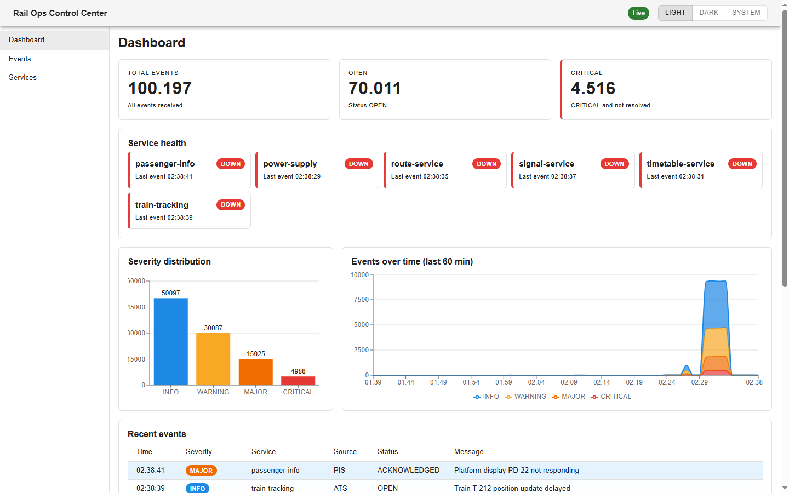
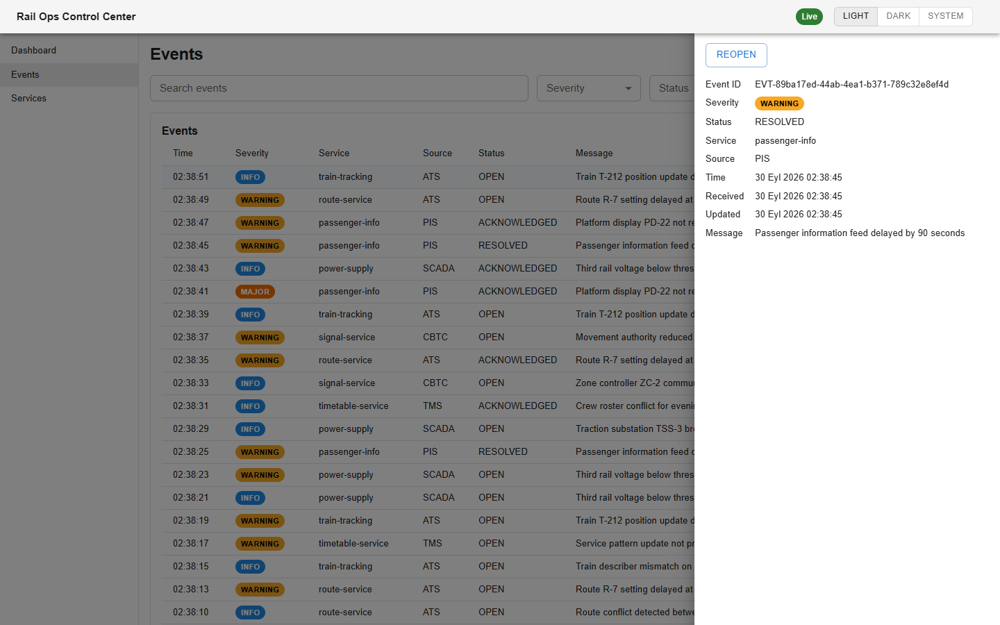
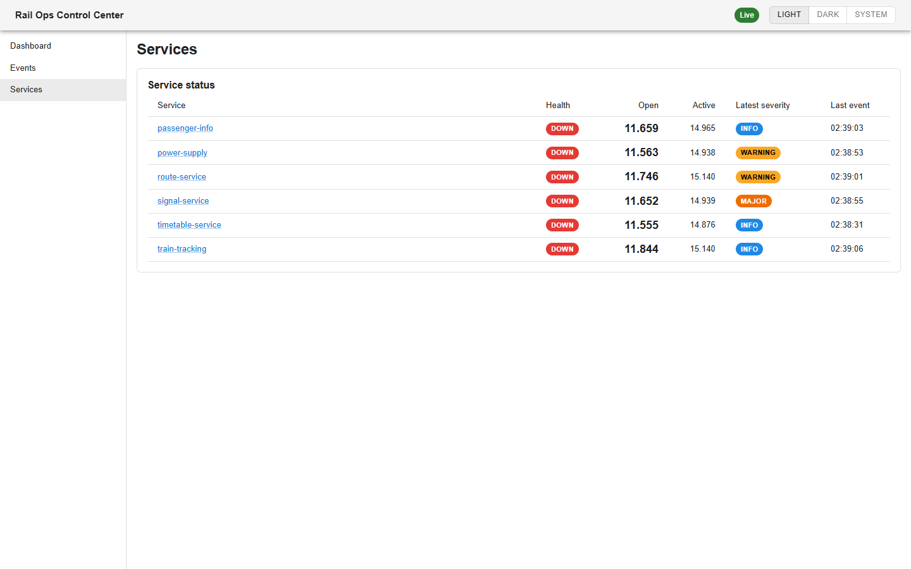
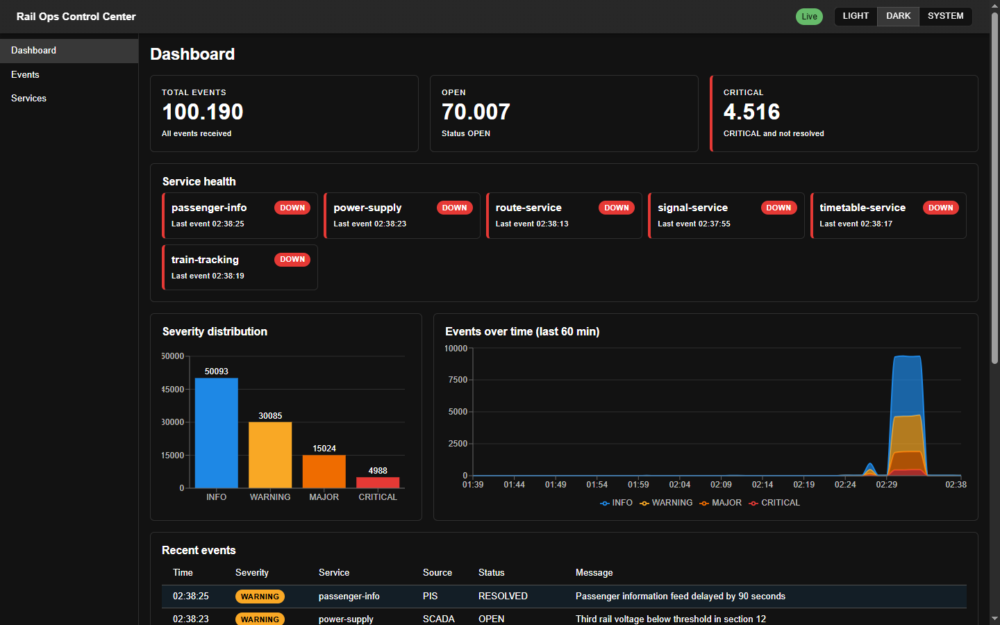
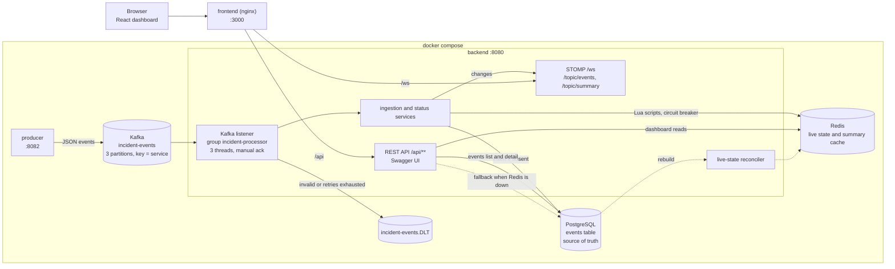

# Alstom Rail Operations Control Center

**Real-time railway operations and mobility incident monitoring**

> A technical assignment for Alstom's Full Stack Software Designer role; not an
> official Alstom product.

Real-time incident monitoring for a rail operations center: a producer publishes
service events to Kafka, a Spring Boot backend processes them into PostgreSQL and
Redis live state, and a React dashboard shows service health and incidents live.

## Contents

- [Screenshots](#screenshots)
- [Quick start](#quick-start)
- [Architecture](#architecture), [Design notes](#design-notes), [Performance notes](#performance-notes)
- [Testing](#testing), [Continuous integration](#continuous-integration)
- [Repository layout](#repository-layout), [Local infrastructure](#local-infrastructure)
- [Event producer](#event-producer), [Event ingestion](#event-ingestion-backend)
- [Events API](#events-api), [Incident status update](#incident-status-update), [Dashboard data APIs](#dashboard-data-apis), [Real-time push](#real-time-push) - full reference in [docs/api.md](docs/api.md)
- [Redis resilience](#redis-resilience), [Observability](#observability)
- [Frontend](#frontend)
- [Known limitations](#known-limitations)

## Screenshots

Captured from the running stack after several bursts of generated events, so
every service shows `DOWN` and the counts are large. Times use the browser's locale.









## Quick start

**Prerequisites:** Docker Desktop (or Docker Engine) with Compose v2, running
(`docker info` succeeds), with at least 4 GB of memory available to Docker. The
whole stack uses about 1.7 GB once running. Nothing else needs to be installed:
the Java and Node builds happen inside the images, and no `.env` file is needed.
These host ports must be free: 3000, 8080, 8081, 8082, 5432, 6379 and 9092.

From the repository root:

```bash
docker compose up -d --build --wait
```

The command builds the three app images, starts all seven services in
dependency order and returns once every one reports `healthy`. Expect about 5
minutes for the very first build (Maven and npm downloads) and 2 to 3 minutes
more for the services to become healthy. Later starts take about 1.5 minutes.
The bare `docker compose up --build` starts the same stack in the foreground.

Then open:

- Dashboard: http://localhost:3000 (it fills within seconds, because the
  producer publishes about 200 events at startup)
- Kafka UI: http://localhost:8081
- API docs (Swagger UI): http://localhost:8080/swagger-ui/index.html

```bash
docker compose ps             # all 7 services should show (healthy)
docker compose down           # stop, keeping data
docker compose down -v        # stop and DELETE all data (Kafka, Redis, Postgres)
```

### Troubleshooting

- **`port is already allocated` or `address already in use`:** another program
  holds one of the host ports. Set the matching variable for that port in a
  `.env` file (copy `.env.example`) or in your shell, then run the command
  again. For example, if something else uses 8080, run
  `BACKEND_PORT=8083 docker compose up -d --build --wait` (in PowerShell:
  `$env:BACKEND_PORT=8083; docker compose up -d --build --wait`), and use
  http://localhost:8083 for the backend. The variables are `FRONTEND_PORT`,
  `BACKEND_PORT`, `KAFKA_UI_PORT`, `PRODUCER_PORT`, `POSTGRES_PORT`,
  `REDIS_PORT` and `KAFKA_PORT`. The dashboard on port 3000 reaches the backend
  through nginx, so it works whatever `BACKEND_PORT` is.
- **A service stays `unhealthy`, or `--wait` reports one that failed:** run
  `docker compose ps` to see which one, then `docker compose logs <service>`.
  A build or container killed with exit code 137 usually means Docker ran out
  of memory; raise its memory limit (Docker Desktop, Settings, Resources) to
  4 GB or more.
- **Git Bash on Windows rewrites paths in `docker compose exec` commands:**
  prefix the command with `MSYS_NO_PATHCONV=1`.

## Architecture



**Ingest path.** The producer publishes JSON events to `incident-events`, keyed
by service so one service's events stay in order on one partition. The backend
listener (consumer group `incident-processor`, three threads) validates each
event and inserts it into PostgreSQL with `ON CONFLICT DO NOTHING`, so a
redelivery is harmless. It then applies the event to Redis in one Lua script
guarded by `processed:{eventId}`, pushes a `CREATED` message over the WebSocket,
and only then acknowledges the Kafka offset. Invalid records go straight to the
dead-letter topic; transient failures are retried with backoff first
([details](#retries-and-the-dead-letter-topic)).

**Status-change path.** `PUT /api/events/{eventId}/status` runs in a PostgreSQL
transaction with optimistic locking, then updates the Redis counters in one Lua
script and pushes an `UPDATED` message.

**Read path.** The events list and detail always come from PostgreSQL. The
dashboard endpoints read the Redis live state (with a 5-second summary cache) and
fall back to PostgreSQL aggregates when Redis is unavailable
([Redis resilience](#redis-resilience)). The browser loads state over REST and
then stays current from the WebSocket ([Frontend](#frontend)).

## Design notes

**Kafka layout.** One topic, `incident-events`, with 3 partitions and 24-hour
retention; the producer declares it, and the backend declares
`incident-events.DLT` (3 partitions, 7 days). The message key is the service
name, so all events of one service go to one partition and are consumed in
order. Ordering across services is not guaranteed and nothing depends on it.
Three partitions match the three listener threads of the consumer group
`incident-processor` (`concurrency: 3` in `backend/src/main/resources/application.yml`),
so each thread owns one partition. Adding backend instances beyond three would
leave the extra ones idle unless the partition count grows.

**Delivery guarantee.** The listener uses `ack-mode: manual_immediate` and
acknowledges an offset only after the PostgreSQL insert and the Redis update
have both succeeded (`IncidentEventListener`), so a crash replays the record
instead of losing it. Replays are safe because `event_id` is unique in
PostgreSQL (`ON CONFLICT DO NOTHING`) and the Redis script applies each
`eventId` once (`processed:{eventId}`). The result is at-least-once delivery
with idempotent effects, not exactly-once. A new consumer group starts at the
earliest retained offset (`auto-offset-reset: earliest`). Failures are retried
with back-off and then dead-lettered
([details](#retries-and-the-dead-letter-topic)).

**PostgreSQL is the source of truth; Redis is derived state.** Every event is
stored in PostgreSQL first. Redis only holds counters, per-service state, the
last two hours of timeline buckets and the 50 latest events
([key table](#live-service-state-redis)), all of which can be recomputed from
the `events` table. That is why Redis can fail without losing data: reads fall
back to PostgreSQL, ingestion keeps going, and the reconciler rebuilds Redis
afterwards ([Redis resilience](#redis-resilience)). The events list, event detail
and status changes never depend on Redis being up.

**Why each Redis piece exists.** The dashboard needs a few numbers many times a
second, so they are precomputed rather than aggregated on every request. One Lua
script updates all keys for an event atomically, which removes the race between
concurrent listener threads and the status endpoint without distributed locks.
A 5-second summary cache plus a version counter keeps repeated dashboard reads
cheap without serving a summary that predates a status change.

## Performance notes

These are single observations from one development machine, not a benchmark.
They show that the pipeline is comfortably faster than the producer's default
rate (one event every 2 seconds); they do not describe production capacity.

- **Machine:** Windows 10 Home, Docker Desktop with the whole stack in
  containers, 8 logical CPUs and about 4 GB of memory available to Docker.
- **State:** stack up and idle apart from the producer's default trickle (one
  event every 2 seconds); PostgreSQL already held tens of thousands of events.
- **Command:** send 10 bursts of 1000 events (about 2% invalid and 5% duplicates,
  the producer defaults), then wait until the backend counters show them all
  handled.

```bash
BACKEND=${BACKEND:-http://localhost:8080}   # set BACKEND_PORT's value here if you changed it
handled() { curl -s "$BACKEND/actuator/prometheus" \
  | grep -E '^ingestion_events_total\{.*outcome="(processed|invalid)"' | awk '{s+=$NF} END{print int(s)}'; }
before=$(handled); SECONDS=0
for i in $(seq 10); do curl -s -X POST "http://localhost:8082/produce?count=1000" > /dev/null; done
until [ $(( $(handled) - before )) -ge 10000 ]; do sleep 1; done
echo "10000 events handled in ${SECONDS}s"
```

- **Observed:** four runs of 10,000 events took about 41, 48, 51 and 62 seconds
  from the first request to the last event handled, that is roughly 160 to 240
  events per second end to end. Publishing the 10,000 events to Kafka took 5 to
  11 seconds of that (the producer waits for Kafka to confirm each batch), so the
  backend consumer, not the producer, is the limiting side. `processed` includes
  duplicates that were skipped; `invalid` events are also counted as `dlt`, so
  the command adds only the first two.
- **Not measured:** API latency under load, WebSocket fan-out to many browsers,
  behaviour with more than one backend instance, memory use, and any comparison
  with other machines or settings. The consumer is likely limited by the
  per-event PostgreSQL insert plus Redis script round trips on three threads,
  but that was not profiled.

## Testing

| Module | Command (repository root unless noted) | Notes |
|---|---|---|
| Producer | `mvn -B -pl producer -am verify` | JUnit 5, Mockito, `@WebMvcTest` |
| Backend | `mvn -B -pl backend -am verify` | Testcontainers start Kafka, PostgreSQL and Redis, so Docker must be running; includes `EndToEndIntegrationTest` |
| Frontend | `npm test` in `frontend/` | Vitest + React Testing Library; `npm run lint` and `npm run build` are the other checks |

`mvn -B verify` from the root runs both Java modules and writes a JaCoCo report
per module at `backend/target/site/jacoco/index.html` and
`producer/target/site/jacoco/index.html`. The same commands run in
[CI](#continuous-integration). Details: [Event ingestion](#event-ingestion-backend)
(backend and end-to-end tests) and [Frontend](#frontend).

## Continuous integration

[`.github/workflows/ci.yml`](.github/workflows/ci.yml) runs on every pull request
and on every push to `main` or `master`. It has three independent jobs, each
runnable locally with the same commands:

| Job | Where | Command |
|---|---|---|
| Backend and producer | repository root (JDK 21, Docker running for Testcontainers) | `mvn -B verify` |
| Frontend | `frontend/` (Node 24) | `npm ci`, `npm run lint`, `npm test`, `npm run build` |
| Docker images | repository root | `docker compose build` |

## Repository layout

- `frontend/` - React + TypeScript + Vite dashboard
- `producer/` - Spring Boot app that publishes simulated incident events to Kafka
- `backend/` - Spring Boot service that consumes events from Kafka, stores them in PostgreSQL, keeps live state in Redis and serves the REST API
- `pom.xml` - Maven parent for the Java modules
- `docker-compose.yml` - local stack
- `docs/` - [REST, WebSocket and operational API reference](docs/api.md) and the screenshots used in this README
- `.github/workflows/ci.yml` - [CI pipeline](#continuous-integration)

## Local infrastructure

The [Quick start](#quick-start) covers starting, stopping and resetting the
stack. To follow one service's logs:

```bash
docker compose logs -f kafka
```

| Service | From the host | From other containers |
|---|---|---|
| Dashboard (nginx) | http://localhost:3000 | `frontend:80` |
| Kafka | `localhost:9092` | `kafka:29092` |
| Kafka UI | http://localhost:8081 | - |
| Producer | http://localhost:8082 | `producer:8080` |
| Backend | http://localhost:8080 | `backend:8080` |
| Redis | `localhost:6379` | `redis:6379` |
| PostgreSQL | `localhost:5432`, database `incidents` | `postgres:5432` |

Kafka runs in KRaft mode (no ZooKeeper) with automatic topic creation turned
off, so topics exist only when the application declares them with their
intended partitions and retention. Redis uses append-only persistence, so its
live counters survive restarts together with the Postgres data.

### Configuration and credentials

Every setting has a default in `docker-compose.yml`, so the stack starts
without a `.env` file. To override ports or credentials, copy `.env.example` to
`.env` and edit it. The database user `rail_ops` / `rail_ops_local_only` is a
local demo default only; applications read credentials from the same
environment variables and never hardcode them. A production deployment would
take credentials from a secrets manager or Docker secrets and would not publish
these ports. All ports are bound to `127.0.0.1`.

## Event producer

`producer/` is a small Spring Boot app that simulates rail control systems
(ATS, CBTC, SCADA, TMS, PIS). It publishes JSON incident events to the Kafka
topic `incident-events`, keyed by service so each service's events stay in
order on one partition. It declares the topic itself (3 partitions, 24h
retention), because the broker does not auto-create topics.

```json
{"eventId":"EVT-3f1c2a9e-8b7d-4e21-9c55-0a6b1d2e3f40","source":"CBTC","service":"signal-service","severity":"CRITICAL","message":"Signal SG-14 failed to clear","status":"OPEN","timestamp":"2026-09-26T14:30:05.123Z"}
```

It sends events in three ways:

- **Seed burst:** about 200 events at startup, timestamped across the last
  hour, so the dashboard is never empty. Every restart seeds again.
- **Auto mode:** one event every `PRODUCER_INTERVAL_MS`.
- **Manual burst:** `curl -X POST "http://localhost:8082/produce?count=50"`
  returns `{"sent":50,"duplicates":2,"invalid":1}` once Kafka confirms every
  event.
  `count` is 1-1000 (default 1). An invalid value returns a 400 problem
  response, and a Kafka outage returns 503.

Severity and status are weighted towards realistic values (mostly `INFO` and
`OPEN`). A share of sends (`PRODUCER_DUPLICATE_RATIO`) re-sends an earlier event
unchanged, with the same `eventId` and payload, to exercise idempotent
processing downstream.

Another share (`PRODUCER_INVALID_RATIO`) is broken on purpose, to show the
backend's [dead-letter handling](#retries-and-the-dead-letter-topic). Each one
is truncated JSON, an unknown `severity`, a blank `service`, or a missing
`eventId`. Invalid messages count towards `sent` and are never re-sent as
duplicates.

| Variable | Default | Meaning |
|---|---|---|
| `PRODUCER_INTERVAL_MS` | `2000` | Delay between auto-mode events (min 100) |
| `PRODUCER_DUPLICATE_RATIO` | `0.05` | Share of sends that re-send a recent event (0-1) |
| `PRODUCER_INVALID_RATIO` | `0.02` | Share of sends that are intentionally invalid (0-1) |
| `PRODUCER_PORT` | `8082` | Host port for `/produce` and `/actuator/health` |

To watch the events, open Kafka UI (http://localhost:8081) and go to
**Topics > incident-events > Messages**.

Build and test the module (JDK 21 and Maven 3.9 from the repository root):

```bash
mvn -pl producer -am verify
```

To run it from an IDE against the compose Kafka, start the stack and run
`ProducerApplication`. It connects to `localhost:9092` by default.

## Event ingestion (backend)

`backend/` is a Spring Boot service that consumes `incident-events` in the
consumer group `incident-processor` (3 listener threads, one per partition) and
stores every valid event in the PostgreSQL table `events`. Flyway creates the
schema on startup.

Processing is at-least-once and idempotent. For each record the backend:

1. validates the payload,
2. runs `INSERT ... ON CONFLICT (event_id) DO NOTHING`,
3. applies the event once to the Redis live state (see
   [Live service state](#live-service-state-redis)),
4. commits the Kafka offset only after both have succeeded.

A redelivered or duplicated event (the producer re-sends some on purpose) is
therefore stored once. The first stored copy wins, and the backend logs
`Duplicate event <id> skipped`.

A message is **invalid** when any of these apply:

- it is not readable JSON, or `severity`/`status`/`timestamp` has an unknown
  value (enum values are case-sensitive names, never numbers; `timestamp` is an
  ISO-8601 string, never an epoch number)
- `timestamp` is before 2000-01-01 or in year 10000 or later
- `eventId`, `service` or `message` is blank, or `eventId`/`service` is longer
  than 64 characters
- `eventId` has a character other than letters, digits, `.`, `_`, `:` and `-`,
  or starts with `.`, so every stored event can be opened at
  `/api/events/{eventId}` (for example `EVT/1` or `..` is invalid)
- `source` is not exactly one of `ATS`, `CBTC`, `SCADA`, `TMS`, `PIS`
- PostgreSQL rejects the data anyway

### Retries and the dead-letter topic

The backend declares `incident-events.DLT` (3 partitions, 7-day retention).
Failed records end up there instead of being dropped or blocking their
partition:

- **Invalid messages** go to the DLT straight away, without retrying.
- **Any other failure**, such as PostgreSQL or Redis being down, is retried
  with exponential back-off: 1s, 2s, 4s, 8s, 16s, then 30s. After 8 retries
  (about 2 minutes) the record goes to the DLT, and the partition moves on.

Each dead-lettered record keeps its key and partition. A message that was not
readable JSON keeps its original bytes; any other message is written as event
JSON. Spring's `kafka_dlt-*` headers record the original topic, partition,
offset and the exception. The offset is committed only once Kafka confirms the
DLT write. If that write fails, the record is attempted again.

Every failed attempt is logged with a short reason, never with payload values,
and so is every record sent to the DLT (`Sent event at <topic-partition@offset>
to incident-events.DLT: <reason>`).

Known limitations:

- A valid event that is dead-lettered after an outage longer than the retry
  window is not in the dashboard. It is kept in the DLT, and because ingestion
  is idempotent it can be republished to `incident-events` safely. There is no
  replay tool yet.
- A Redis outage no longer sends events to the DLT: the event is stored in
  PostgreSQL, the Redis update is skipped, and the live state is rebuilt from
  PostgreSQL when Redis returns (see [Redis resilience](#redis-resilience)).

Inspect stored events:

```bash
docker compose exec postgres psql -U rail_ops -d incidents   -c "select event_id, source, service, severity, status, timestamp from events order by timestamp desc limit 10;"
```

Publish an invalid message by hand and watch it reach the DLT (in Git Bash,
prefix each command with `MSYS_NO_PATHCONV=1`):

```bash
echo '{not json' | docker compose exec -T kafka /opt/kafka/bin/kafka-console-producer.sh   --bootstrap-server kafka:29092 --topic incident-events
docker compose logs backend | grep "incident-events.DLT"
docker compose exec kafka /opt/kafka/bin/kafka-console-consumer.sh   --bootstrap-server kafka:29092 --topic incident-events.DLT --from-beginning   --property print.headers=true --timeout-ms 5000
```

Or open Kafka UI (http://localhost:8081) and go to
**Topics > incident-events.DLT > Messages**.

| Variable | Default | Meaning |
|---|---|---|
| `BACKEND_PORT` | `8080` | Host port for the backend (`/actuator/health`) |

If port 8080 is already taken on your machine, set `BACKEND_PORT` in `.env`.

Build and test the module from the repository root with JDK 21 and Maven 3.9.
The tests start Kafka, PostgreSQL and Redis with Testcontainers, so Docker
Desktop must be running:

```bash
mvn -pl backend -am verify
```

`EndToEndIntegrationTest` runs the whole pipeline against real Kafka, PostgreSQL
and Redis containers, feeding it only through Kafka and the HTTP API and
checking only HTTP responses, `/actuator/prometheus` and the dead-letter topic.
It covers three flows: the happy path (events, status changes and duplicates
reflected in the events, summary, services and recent-events endpoints), the
dead-letter path (invalid records reach `incident-events.DLT` without blocking
valid ones) and Redis down (the API keeps answering from Postgres, then
converges once Redis returns). Run it alone with:

```bash
mvn -pl backend -am -Dtest=EndToEndIntegrationTest -Dsurefire.failIfNoSpecifiedTests=false verify
```

`verify` also writes a JaCoCo coverage report for each module. Open
`backend/target/site/jacoco/index.html` (or `producer/target/site/jacoco/index.html`)
in a browser after a run.

To run it from an IDE against the compose stack, start the stack and run
`BackendApplication`. It connects to `localhost:9092` and
`localhost:5432/incidents` and Redis on `localhost:6379` by default.

### Live service state (Redis)

After storing an event, the backend runs one Lua script, `apply-event`
(`backend/src/main/resources/redis/apply-event.lua`), that updates all live
state atomically. It first sets `processed:{eventId}` (`SET NX`, 24h TTL, the
same as the topic retention); if that key already exists the event was already
applied and nothing else changes, so redelivered and duplicate events are
counted once.

| Key | Type | Content |
|---|---|---|
| `events:count` | String | all events |
| `severity:{SEV}:count` | String | all events per severity |
| `status:{STATUS}:count` | String | events per current status (moved by [status changes](#incident-status-update)) |
| `active:{SEV}:count` | String | active (`OPEN` or `ACKNOWLEDGED`) events per severity |
| `services` | Set | known service names |
| `service:{name}` | Hash | `active:INFO`/`WARNING`/`MAJOR`/`CRITICAL`, `openCount`, `activeCount`, `status`, `lastEventTime`, `latestSeverity` |
| `timeline:{yyyyMMddHHmm}` | Hash | events per severity in that UTC minute of the event `timestamp`; expires 2h after the minute |
| `recent:events` | List | the 50 most recently applied event ids, newest first |
| `processed:{eventId}` | String | apply-once guard, 24h TTL |
| `cache:dashboard:summary` | String | the dashboard summary JSON, 5s TTL (see [Dashboard data APIs](#dashboard-data-apis)) |
| `cache:dashboard:summary:version` | String | counter bumped by every applied status change; a summary is cached only if it is unchanged |

A service's `status` is recalculated from its active counts on every event:
any active `CRITICAL` makes it `DOWN`, otherwise any active `MAJOR` or
`WARNING` makes it `DEGRADED`, otherwise it is `HEALTHY`. `lastEventTime` and
`latestSeverity` follow the newest event `timestamp`, not arrival order.
Events older than the 2-hour timeline window do not create a timeline bucket.

If Redis is empty or has fallen behind PostgreSQL (for example after a wipe or
an outage), the backend rebuilds it from the stored events; see
[Redis resilience](#redis-resilience).

Inspect the live state:

```bash
docker compose exec redis redis-cli GET events:count
docker compose exec redis redis-cli SMEMBERS services
docker compose exec redis redis-cli HGETALL service:signal-service
docker compose exec redis redis-cli LRANGE recent:events 0 9
```

## Events API

The backend serves stored events from PostgreSQL. Interactive docs are at
http://localhost:8080/swagger-ui/index.html (OpenAPI JSON at `/v3/api-docs`).
The full request and response reference, with `curl` examples for every REST,
WebSocket and operational endpoint, is in [docs/api.md](docs/api.md).

| Method | Path | Returns |
|---|---|---|
| `GET` | `/api/events` | a page of events, newest first by default |
| `GET` | `/api/events/{eventId}` | one event, or 404 |

Query parameters for `/api/events` (all optional, combined with AND):

| Parameter | Meaning |
|---|---|
| `severity` | `INFO`, `WARNING`, `MAJOR` or `CRITICAL` |
| `status` | `OPEN`, `ACKNOWLEDGED` or `RESOLVED` |
| `source`, `service` | exact, case-sensitive match |
| `q` | case-insensitive text in `message`, `service` or `eventId` (at most 200 characters) |
| `page` | zero-based page number, default 0 |
| `size` | 1 to 100, default 20 |
| `sort` | `field` or `field,asc\|desc` with `field` one of `timestamp`, `receivedAt`, `service`, `source`, `eventId`; default `timestamp,desc` |

Severity and status are not sortable because they are stored as text and would
sort alphabetically rather than by rank.

A list response looks like this:

```json
{
  "content": [
    {
      "eventId": "EVT-3f1c...",
      "source": "CBTC",
      "service": "signal-service",
      "severity": "CRITICAL",
      "message": "Signal failure at ...",
      "status": "OPEN",
      "timestamp": "2026-09-26T14:30:05.123Z",
      "receivedAt": "2026-09-26T14:30:05.456Z",
      "updatedAt": "2026-09-26T14:30:05.456Z"
    }
  ],
  "page": 0,
  "size": 20,
  "totalElements": 137,
  "totalPages": 7
}
```

Errors use RFC 7807 problem details (`application/problem+json`): 404 for an
unknown event id, 400 for an invalid parameter value, and 500 with a generic
message for anything unexpected (details stay in the backend log).

```bash
curl "http://localhost:8080/api/events?severity=CRITICAL&status=OPEN&q=signal&size=5"
curl "http://localhost:8080/api/events/EVT-10001"
```

## Incident status update

`PUT /api/events/{eventId}/status` moves an incident through its lifecycle:

| From | Allowed to |
|---|---|
| `OPEN` | `ACKNOWLEDGED`, `RESOLVED` |
| `ACKNOWLEDGED` | `RESOLVED` |
| `RESOLVED` | `OPEN` (reopen) |

```bash
curl -X PUT "http://localhost:8080/api/events/EVT-10001/status" \
  -H "Content-Type: application/json" -d '{"status":"ACKNOWLEDGED"}'
```

A successful change returns 200 with the updated event (same shape as
`GET /api/events/{eventId}`, with a new `updatedAt`). Sending the current
status also returns 200 and changes nothing.

| Case | Response |
|---|---|
| Transition not in the table | 409, `type: /problems/invalid-status-transition`, with `allowedTransitions` |
| Another request changed the event at the same time | 409, title `Concurrent update`; reload and retry |
| Unknown `eventId` | 404 |
| Missing, unknown or numeric `status`, or a body that is not JSON | 400 naming `status` and its allowed values |

```json
{
  "type": "/problems/invalid-status-transition",
  "title": "Invalid status transition",
  "status": 409,
  "detail": "Cannot change status from RESOLVED to ACKNOWLEDGED",
  "instance": "/api/events/EVT-10001/status",
  "allowedTransitions": ["OPEN"]
}
```

The change is committed to PostgreSQL first. Clients send no version: JPA
optimistic locking (`@Version`) detects overlapping writes on the server. After
the commit, the Lua script `apply-status-change` updates the Redis live state
in one step: the `status:*:count` and `active:{SEV}:count` counters, and the
service's `active:{SEV}`, `openCount`, `activeCount` and health. Event totals,
the timeline, the recent list and `lastEventTime` are not touched, because a
status change is not a new event.

If Redis is unavailable after the commit, the request still succeeds, the
backend logs a warning, and it flags the live state for a rebuild from
PostgreSQL (see [Redis resilience](#redis-resilience)).

Known limitation: if the event's service has no live state in Redis yet (its
first event has not been applied, or Redis was wiped), the Lua script returns
0. The status change is committed to PostgreSQL and pushed, but the Redis
update is skipped with a WARN log and no rebuild is flagged, so Redis counts
stay stale until the next rebuild. Normally the window is milliseconds.

## Dashboard data APIs

Read endpoints for the dashboard and service status pages. They read the Redis
live state, and the recent events also load their rows from PostgreSQL.

| Method | Path | Returns |
|---|---|---|
| `GET` | `/api/dashboard/summary` | totals, severity distribution and service health; cached up to 5s |
| `GET` | `/api/services` | each service's live state, sorted by name |
| `GET` | `/api/dashboard/timeline?minutes=60` | events per UTC minute by severity; `minutes` 1-120, default 60 |
| `GET` | `/api/dashboard/recent-events?limit=20` | the most recently processed events, newest first; `limit` 1-50, default 20 |

```bash
curl "http://localhost:8080/api/dashboard/summary"
curl "http://localhost:8080/api/services"
curl "http://localhost:8080/api/dashboard/timeline?minutes=15"
curl "http://localhost:8080/api/dashboard/recent-events?limit=5"
```

Summary:

```json
{
  "totalEvents": 214,
  "openEvents": 120,
  "acknowledgedEvents": 30,
  "criticalEvents": 12,
  "severityDistribution": {"INFO": 90, "WARNING": 70, "MAJOR": 40, "CRITICAL": 14},
  "services": [
    {"name": "signal-service", "status": "DOWN", "lastEventTime": "2026-09-27T12:30:05.123Z"}
  ]
}
```

`criticalEvents` counts CRITICAL events that are not RESOLVED;
`severityDistribution` counts all events. Service `status` is `HEALTHY`,
`DEGRADED` (an active MAJOR or WARNING incident) or `DOWN` (an active CRITICAL
incident).

`/api/services` items add `latestSeverity`, `openCount` and `activeCount` to
the summary's service fields. Timeline items look like
`{"minute":"2026-09-27T12:30:00Z","counts":{"INFO":0,"WARNING":2,"MAJOR":0,"CRITICAL":1}}`:
one per minute, oldest first, ending with the current minute, with zeros for
minutes without events. Recent events use the event shape of
`GET /api/events/{eventId}`.

The summary is cached in `cache:dashboard:summary` for 5 seconds. A status
change deletes it in the same Lua script that updates the counters, so the next
read shows the change. The script also bumps `cache:dashboard:summary:version`,
and a summary is only cached (by the `cache-summary` Lua script) when that
version is unchanged since the summary's counters were read, so a summary built
while a status change lands is never cached. New events appear once the cache
expires. An
out-of-range or non-numeric `minutes` or `limit` returns 400 naming the
parameter.

If Redis is unavailable, these endpoints answer from PostgreSQL aggregates
instead, with the same response shapes (see [Redis resilience](#redis-resilience)).

## Real-time push

The backend pushes changes over STOMP on a native WebSocket at `/ws`
(`ws://localhost:8080/ws`, or `/ws` through the frontend on port 3000 and the
Vite dev server, which both proxy it). Clients only subscribe; a `SEND` frame
gets an `ERROR` frame and the connection is closed. Browsers must connect from
the same origin as the page. The broker sends heart-beats every 10 seconds.

| Topic | When | Body |
|---|---|---|
| `/topic/events` | an event is ingested for the first time, or its status changes | `{"type":"CREATED"\|"UPDATED","event":{...}}` |
| `/topic/summary` | at most once a second, only after a change | the `GET /api/dashboard/summary` body |

`event` has the shape of `GET /api/events/{eventId}`. A duplicate or invalid
event, and a status request that changes nothing or fails, push nothing. The
pushed summary is built from the live counters rather than the 5-second cache,
so it includes new events straight away.

Delivery is best effort: nothing is replayed after a reconnect, there is no
message on subscribe, and events from different Kafka partitions can arrive
in any order. Clients load state over the REST API and use pushes to stay
current. A failed push is logged and never fails ingestion or a status update.

To see the handshake through nginx with the stack running:

```bash
curl -i -N -H "Connection: Upgrade" -H "Upgrade: websocket"   -H "Sec-WebSocket-Version: 13" -H "Sec-WebSocket-Key: dGhlIHNhbXBsZSBub25jZQ=="   -H "Origin: http://localhost:3000" http://localhost:3000/ws
```

It answers `101 Switching Protocols`; with another `Origin` it answers `403`.

## Redis resilience

PostgreSQL is the source of truth; Redis only holds derived live state (counters,
service health, timeline, recent list, summary cache). A Redis outage therefore
degrades speed, not correctness.

**Circuit breaker.** One Resilience4j breaker named `redis` wraps every Redis
call the backend makes: the two Lua applies (`apply-event`,
`apply-status-change`) and all dashboard reads. Its settings are in
`backend/src/main/resources/application.yml`:

| Setting | Value |
|---|---|
| Redis command timeout | 500 ms (fail fast instead of the 60 s client default) |
| Window | last 10 calls, evaluated from the 5th call |
| Opens at | 50 % failures (only `DataAccessException` counts) |
| Open for | 5 s, then half-open automatically and allows 2 probe calls |

**Writes never fail because of Redis.** Ingestion and status changes commit to
PostgreSQL first. If the Redis update then fails (or the breaker is open), the
backend logs a WARN, still pushes the change over the WebSocket, and sets an
in-memory *reconcile-needed* flag. The Kafka consumer keeps acknowledging events,
so nothing goes to the DLT because of Redis.

**Reads fall back to PostgreSQL.** While Redis is unavailable, `summary`,
`services`, `timeline` and `recent-events` are computed from PostgreSQL
aggregates with the same response shapes, so the dashboard keeps working (slower
on large tables). Each fallback logs one WARN line without a stack trace; the
stack trace is at DEBUG.

**Reconciler.** `LiveStateReconciler` rebuilds Redis from PostgreSQL:

- at startup, when the `services` key is missing (empty Redis);
- when the breaker closes again while the flag is set;
- every 30 s while the flag is set and the breaker is closed (a safety net for
  outages too short to trip the breaker, or a rebuild that itself failed).

A rebuild pauses the Kafka listener and blocks status changes, computes the whole
snapshot from PostgreSQL, and writes absolute values in a single `MULTI/EXEC`
batch, so readers never see a half-built state. It then clears the summary
cache, clears the flag, resumes the listener and logs `Live state reconciled
from Postgres`. The rebuild does not replay events through the Lua scripts,
because their `processed:{eventId}` guard would skip events whose Redis state is
stale. It restores counters, service state, the last two hours of timeline
buckets and the 50 most recent events, but not the `processed:{eventId}` guards
(see [Known limitations](#known-limitations)).

Try it with the stack running (in Git Bash, prefix `docker compose exec` with
`MSYS_NO_PATHCONV=1` if needed):

```bash
docker compose stop redis
curl -s http://localhost:3000/api/dashboard/summary    # still 200, served from PostgreSQL
curl -s -X PUT http://localhost:3000/api/events/<eventId>/status   -H "Content-Type: application/json" -d '{"status":"ACKNOWLEDGED"}'    # still 200
docker compose logs backend | grep -E "Redis unavailable|Live state"
docker compose start redis
# within about a minute the log shows: Live state reconciled from Postgres
```

While Redis is down, `resilience4j_circuitbreaker_state{name="redis",state="open"}`
on `/actuator/prometheus` is `1.0`. After Redis is back the breaker goes
half-open and closes once two probe calls succeed, which ordinary dashboard
traffic or an ingested event supplies; the rebuild runs when it closes.

## Observability

- **Logs.** The backend writes one JSON object per line to stdout
  (`logstash-logback-encoder`, configured in
  `backend/src/main/resources/logback-spring.xml`), with `@timestamp`, `level`,
  `logger_name`, `thread_name`, `message` and `stack_trace` when present. While an
  event is being ingested, skipped, retried or status-changed, its ID is in the
  logging context, so those lines also carry an `eventId` field. Follow one event:
  `docker compose logs backend | grep '"eventId":"EVT-..."'`.
- **Health.** `GET /actuator/health` on the backend (`:8080`) and the producer
  (`:8082`) returns `{"status":"UP"}`. Compose healthchecks use it. Details are
  not exposed.
- **Metrics.** `GET http://localhost:8080/actuator/prometheus` (the only
  exposed endpoints on the backend are `health` and `prometheus`):

| Metric | Meaning |
|---|---|
| `ingestion_events_total{outcome="processed"}` | valid events handled, including redelivered duplicates that were skipped as already stored |
| `ingestion_events_total{outcome="invalid"}` | records rejected as malformed or failing validation |
| `ingestion_events_total{outcome="dlt"}` | records published to `incident-events.DLT` (every invalid record, plus valid ones whose retries ran out) |
| `resilience4j_circuitbreaker_state{name="redis",state=...}` | `1.0` on the current breaker state (`closed`, `open`, `half_open`) |
| `resilience4j_circuitbreaker_calls_seconds_count{name="redis",kind=...}` | Redis calls by outcome (`successful`, `failed`) |
| `resilience4j_circuitbreaker_not_permitted_calls_total{name="redis"}` | calls rejected while the breaker was open |

The standard JVM, HTTP server, Kafka consumer and Hikari pool metrics from
Micrometer are on the same endpoint. There is no Prometheus or Grafana container
in the stack; the endpoint is there to be scraped.

```bash
curl -s http://localhost:8080/actuator/prometheus | grep -E "^(ingestion_events_total|resilience4j_circuitbreaker_state)"
```

## Frontend

The dashboard is a React + TypeScript + Vite app (React Router, TanStack
Query, MUI, Recharts). With the compose stack running, open
http://localhost:3000: nginx serves the built app and proxies `/api` to the
backend, and any other path loads the app, so routes such as `/dashboard` can
be reloaded or linked directly.

| Route | Page |
|---|---|
| `/` | redirects to `/dashboard` |
| `/dashboard` | KPI cards, service health, severity and events-over-time charts, recent events |
| `/events` | server-paginated events table with filters and search in the query string |
| `/events/:eventId` | the events page with that event's detail drawer open |
| `/services` | per-service health, open and active incident counts, latest severity, last event |

The app keeps one STOMP connection to `/ws` for its lifetime (see
[Real-time push](#real-time-push)). Pushed events and summaries patch the
TanStack Query cache directly, and the data a push cannot patch exactly (event
lists, timeline, services) is refetched at most once a second. A chip in the
top bar shows the connection: Connecting, Live, Reconnecting, or Offline once
the socket has been down for 10 seconds. The client reconnects on its own with
exponential backoff (1 s up to 30 s) and refetches over REST after every
(re)connect, because nothing is replayed.

Polling every 5 seconds (the summary cache lifetime) is only a fallback: it runs
while the connection is not Live and pauses while the browser tab is hidden. A
row that was just created or updated, including by another operator, is
highlighted for 3 seconds. If the backend is unreachable, each section keeps its
last data or shows its error state, and a single "Can't reach the backend -
retrying" message appears on the first failed request (within a few seconds) and
stays open until the API answers again. The top bar has a Light / Dark / System
theme switch; the choice is remembered in the browser.

The events page keeps its state in the URL, so any view can be reloaded,
bookmarked or shared: severity, status, source and service filters, the search
text `q` (matched case-insensitively against message, service and event ID,
applied 300 ms after typing stops) and a 1-based `page`, for example
`/events?severity=CRITICAL&status=OPEN&q=signal&page=2`. Changing a filter goes
back to page 1. Clicking a row or its event ID opens the detail drawer at
`/events/<eventId>` with the same query string; closing it returns to the
filtered table, and an unknown ID shows "Event not found". The drawer offers
only the status changes the lifecycle allows (Acknowledge, Resolve, Reopen).
The new status shows at once; if the backend rejects the change (for example a
409 for an invalid transition or an overlapping update) it rolls back and the
reason appears in an error message. While the connection is not Live, the table
and drawer poll every 5 seconds like the dashboard, pausing while a status
change is in flight.

The services page lists every service that has reported, sorted by name, with
its health, open incidents (the main column), active incidents (open or
acknowledged), latest severity and last event time. It is kept current by the
live connection, or by 5-second polling while the connection is down.
Each service name opens the events page filtered to that service. Before any
event arrives it says so instead of showing an empty table.

For development, run the Vite dev server against the backend on the host
(`BACKEND_PORT`, default 8080):

```bash
cd frontend
npm install
npm run dev     # http://localhost:5173, proxies /api to the backend
npm test        # Vitest + React Testing Library
npm run lint
npm run build   # typecheck + production bundle
```

## Known limitations

What this project deliberately does not solve, with links to the detail.

**Data and delivery**

- **No exactly-once processing.** Delivery is at-least-once with idempotent
  effects ([Design notes](#design-notes)). The Redis rebuild restores counters,
  service state, timeline and the recent list but not the `processed:{eventId}`
  guards ([Redis resilience](#redis-resilience)). If an offset reset makes the
  backend re-consume an event that is stored in PostgreSQL within the 24-hour
  window, Redis counts it a second time until the next rebuild.
- **No dead-letter replay tool.** A valid event dead-lettered because an outage
  outlasted the retry window is kept in `incident-events.DLT` but is not on the
  dashboard until someone republishes it
  ([Retries and the dead-letter topic](#retries-and-the-dead-letter-topic)).
- **The reconcile-needed flag is in memory.** A backend restart forgets that a
  rebuild was pending. The startup rebuild only runs when the Redis `services`
  key is missing, so Redis that fell behind and survived the restart stays stale
  until the next flagged failure or a wipe. Likewise, if Redis loses its data
  while no Redis write fails (reads alone do not flag a rebuild), the dashboard
  keeps serving understated totals. Compose runs Redis with append-only
  persistence on a named volume, so a plain restart does not lose data.
- **A status change can skip Redis without flagging a rebuild** when the event's
  service has no live state yet; the counters stay stale until the next rebuild
  ([Incident status update](#incident-status-update)).
- **Event search is not indexed for text.** `q` is a case-insensitive
  substring match, and every list request also counts the matching rows. Text
  search cannot use an index, so it slows down as the table grows. Single
  `curl` observations here with about 100,000 stored events: a `q` search took about
  0.4 to 1.7 s and a plain page 0.2 to 0.3 s; nothing was tuned or profiled.
- **The rebuilt timeline covers about two hours**, the same window as the
  `timeline:*` buckets and the `minutes` limit of the timeline endpoint.

**Real-time behaviour**

- **WebSocket delivery is best effort.** Nothing is sent on subscribe or
  replayed after a reconnect, and events from different partitions can arrive
  out of order (a `CREATED` push can even arrive after an `UPDATED` push for the
  same event, in a window of milliseconds); the dashboard reloads state over REST
  when it reconnects
  ([Real-time push](#real-time-push)).
- **One backend instance.** The STOMP broker is Spring's in-memory simple
  broker, so pushes are not shared between instances, and the reconcile flag and
  the summary throttle are per-process. Kafka, PostgreSQL and Redis are single
  nodes in Compose.

**Scope**

- **No authentication or authorization.** Every endpoint is open; this is a
  local single-machine demo, not a hardened deployment. The database
  credentials are local development defaults
  ([Configuration and credentials](#configuration-and-credentials)).
- **Not built:** user login, distributed tracing, continuous deployment and
  Kubernetes manifests. CI runs tests and builds only
  ([Continuous integration](#continuous-integration)).
- **Performance figures are single local observations**, not benchmarks
  ([Performance notes](#performance-notes)).
